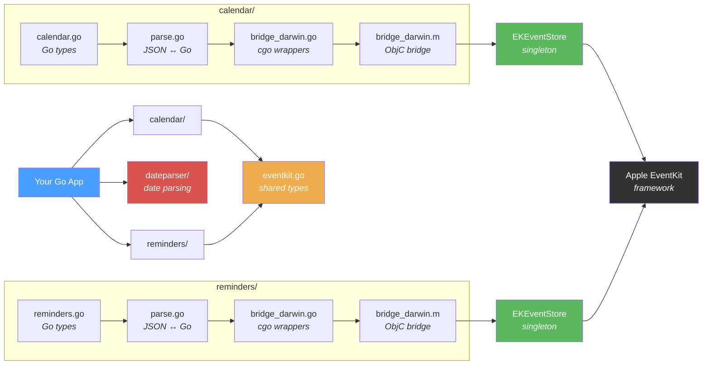

# go-eventkit

Native macOS Calendar and Reminders access for Go. **3000x faster than AppleScript.**

```go
client, _ := calendar.New()
events, _ := client.Events(time.Now(), time.Now().Add(7*24*time.Hour)) // ~9ms
```

No AppleScript. No subprocesses. Direct EventKit access via cgo, with an idiomatic Go API.

|                       | go-eventkit | AppleScript | Speedup   |
| --------------------- | ----------- | ----------- | --------- |
| Fetch calendars       | 0.2ms       | 620ms       | **3101x** |
| Fetch events (7 days) | 18ms        | 432ms       | **24x**   |
| Fetch reminders       | 47ms        | 9.2s        | **197x**  |

## Features

- **Calendar events** — Full CRUD: list/create/rename/delete calendars, query events by date range, create, update, delete
- **Reminders** — Full CRUD: list/create/rename/delete reminder lists, query/filter reminders, create, update, delete, complete/uncomplete
- **Recurrence rules** — Daily, weekly, monthly, yearly with full constraint support (days of week, days of month, set positions, end date/count)
- **Structured locations** — Geographic coordinates and geofence radius on events
- **Change notifications** — `WatchChanges(ctx)` delivers a signal on any EventKit database change (iCloud sync, other apps, own writes) via a Go channel
- **Date parsing** — Shared natural language date parser (`dateparser/`) with support for "tomorrow 2pm", "next friday", "in 3 hours", "eow", ISO 8601, and more
- **All accounts** — Sees iCloud, Google, Exchange, subscribed, and local calendars/reminders
- **Concurrency safe** — Write operations serialized via dispatch queue, inline error returns (no thread-local storage), safe for use from multiple goroutines
- **Pure Go API** — Idiomatic types, no cgo leaking to consumers
- **Cross-platform safe** — Types importable everywhere, bridge returns `ErrUnsupported` on non-darwin

## Requirements

- macOS (darwin), Go 1.24+, Xcode Command Line Tools (`xcode-select --install`)

## Installation

```bash
go get github.com/BRO3886/go-eventkit
```

## Quick Start

### Calendar

```go
package main

import (
    "fmt"
    "log"
    "time"

    "github.com/BRO3886/go-eventkit"
    "github.com/BRO3886/go-eventkit/calendar"
)

func main() {
    client, err := calendar.New()
    if err != nil {
        log.Fatal(err) // TCC access denied
    }

    // List all calendars
    calendars, _ := client.Calendars()
    for _, c := range calendars {
        fmt.Printf("%s (%s, %s)\n", c.Title, c.Type, c.Source)
    }

    // Fetch events for the next 7 days
    now := time.Now()
    events, _ := client.Events(now, now.Add(7*24*time.Hour))
    for _, e := range events {
        fmt.Printf("%s: %s - %s\n", e.Title, e.StartDate.Format(time.Kitchen), e.EndDate.Format(time.Kitchen))
    }

    // Create an event
    event, _ := client.CreateEvent(calendar.CreateEventInput{
        Title:     "Team standup",
        StartDate: time.Date(2026, 2, 12, 10, 0, 0, 0, time.Local),
        EndDate:   time.Date(2026, 2, 12, 10, 30, 0, 0, time.Local),
        Calendar:  "Work",
        Alerts:    []calendar.Alert{{RelativeOffset: -15 * time.Minute}},
    })
    fmt.Printf("Created: %s (ID: %s)\n", event.Title, event.ID)

    // Create a recurring event with a structured location
    event, _ = client.CreateEvent(calendar.CreateEventInput{
        Title:     "Weekly sync",
        StartDate: time.Date(2026, 2, 12, 14, 0, 0, 0, time.Local),
        EndDate:   time.Date(2026, 2, 12, 15, 0, 0, 0, time.Local),
        Calendar:  "Work",
        RecurrenceRules: []eventkit.RecurrenceRule{
            eventkit.Weekly(1, eventkit.Monday, eventkit.Wednesday, eventkit.Friday).
                Until(time.Date(2026, 12, 31, 0, 0, 0, 0, time.Local)),
        },
        StructuredLocation: &eventkit.StructuredLocation{
            Title:     "Apple Park",
            Latitude:  37.3349,
            Longitude: -122.0090,
            Radius:    150,
        },
    })
    fmt.Printf("Created recurring: %s (rules: %d)\n", event.Title, len(event.RecurrenceRules))
}
```

### Reminders

```go
package main

import (
    "fmt"
    "log"
    "time"

    "github.com/BRO3886/go-eventkit/reminders"
)

func main() {
    client, err := reminders.New()
    if err != nil {
        log.Fatal(err)
    }

    // List all reminder lists
    lists, _ := client.Lists()
    for _, l := range lists {
        fmt.Printf("%s (%d items)\n", l.Title, l.Count)
    }

    // Get incomplete reminders from a specific list
    items, _ := client.Reminders(
        reminders.WithList("Shopping"),
        reminders.WithCompleted(false),
    )
    for _, r := range items {
        fmt.Printf("[ ] %s (due: %v)\n", r.Title, r.DueDate)
    }

    // Create a reminder
    due := time.Now().Add(24 * time.Hour)
    reminder, _ := client.CreateReminder(reminders.CreateReminderInput{
        Title:    "Buy milk",
        ListName: "Shopping",
        DueDate:  &due,
        Priority: reminders.PriorityHigh,
    })
    fmt.Printf("Created: %s (ID: %s)\n", reminder.Title, reminder.ID)

    // Complete it
    client.CompleteReminder(reminder.ID)
}
```

### Change Notifications

```go
ctx, cancel := signal.NotifyContext(context.Background(), os.Interrupt)
defer cancel()

// Calendar changes
changes, err := client.WatchChanges(ctx)
if err != nil {
    log.Fatal(err)
}
for range changes {
    events, _ := client.Events(start, end)
    render(events) // re-fetch on every signal
}
```

```go
// Reminders changes
changes, err := remClient.WatchChanges(ctx)
for range changes {
    items, _ := remClient.Reminders(reminders.WithCompleted(false))
    render(items)
}
```

The channel is buffered (cap 16) and excess signals are coalesced — consumers always re-fetch. The channel closes when `ctx` is cancelled or the pipe fails. Only one watcher may be active per package at a time.

> **Cross-process note**: If your consumer and producer are separate binaries, the consumer must pump the main CFRunLoop to receive cross-process `EKEventStoreChangedNotification`. See [`scripts/watch-demo/consumer`](scripts/watch-demo/consumer/main.go) for the `runtime.LockOSThread()` + `CFRunLoopRunInMode` pattern. Single-binary use (same process writes and watches) works without any run loop setup.

### Date Parsing

```go
import "github.com/BRO3886/go-eventkit/dateparser"

// Simple usage (defaults: midnight, no rollover)
t, err := dateparser.ParseDate("tomorrow 2pm")
t, err = dateparser.ParseDate("next friday")
t, err = dateparser.ParseDate("in 3 hours")
t, err = dateparser.ParseDate("mar 15")
t, err = dateparser.ParseDate("eow") // Friday 5pm

// Reminder-style: bare dates at 9am, past times roll to tomorrow
t, err = dateparser.ParseDate("tomorrow",
    dateparser.WithDefaultHour(9),        // "today" → 9am not midnight
    dateparser.WithSmartTimeRollover(),    // "9am" when past → tomorrow
    dateparser.WithEOWSkipToday(),         // "eow" on Friday → next Friday
)

// Deterministic (for testing)
t, err = dateparser.ParseDateRelativeTo("in 3 hours", refTime)

// Formatting
dateparser.FormatDuration(start, end, false)    // "1h 30m"
dateparser.FormatTimeRange(start, end, true)    // "All Day"
d, err := dateparser.ParseAlertDuration("15m")  // 15 * time.Minute
```

Supports: keywords (`today`, `tomorrow`, `now`, `eod`, `eow`, `this week`, `next week`, `next month`), relative (`in 3 hours`, `5 days ago`), weekdays (`next monday`, `friday 2pm`), month-day (`mar 15`, `21 march 2026`), time-only (`5pm`, `17:00`), and standard formats (ISO 8601, RFC 3339, US dates).

## API Reference

### Calendar Package

```go
import "github.com/BRO3886/go-eventkit/calendar"
```

| Method                                               | Description                       |
| ---------------------------------------------------- | --------------------------------- |
| `New() (*Client, error)`                             | Create client, request TCC access |
| `Calendars() ([]Calendar, error)`                    | List all calendars                |
| `Events(start, end, ...ListOption) ([]Event, error)` | Query events in date range        |
| `Event(id) (*Event, error)`                          | Get single event by ID            |
| `CreateEvent(input) (*Event, error)`                 | Create a new event                |
| `UpdateEvent(id, input, span) (*Event, error)`       | Update an existing event          |
| `DeleteEvent(id, span) error`                        | Delete an event                   |
| `CreateCalendar(input) (*Calendar, error)`           | Create a new calendar             |
| `UpdateCalendar(id, input) (*Calendar, error)`       | Rename or recolor a calendar      |
| `DeleteCalendar(id) error`                           | Delete a calendar and its events  |
| `WatchChanges(ctx) (<-chan struct{}, error)`          | Subscribe to database changes     |

**Filter options:** `WithCalendar(name)`, `WithCalendarID(id)`, `WithSearch(query)`

**Recurrence constructors** (from root `eventkit` package): `eventkit.Daily(interval)`, `eventkit.Weekly(interval, ...days)`, `eventkit.Monthly(interval, ...daysOfMonth)`, `eventkit.Yearly(interval)` — chain with `.Until(time)` or `.Count(n)`

### Dateparser Package

```go
import "github.com/BRO3886/go-eventkit/dateparser"
```

| Function | Description |
| --- | --- |
| `ParseDate(input, ...Option) (time.Time, error)` | Parse natural language date using wall clock |
| `ParseDateRelativeTo(input, now, ...Option) (time.Time, error)` | Parse relative to a given time (testable) |
| `FormatDuration(start, end, allDay) string` | Human-readable duration ("1h 30m", "All Day") |
| `FormatTimeRange(start, end, allDay) string` | Human-readable time range for display |
| `ParseAlertDuration(s) (time.Duration, error)` | Parse "15m", "1h", "1d" into duration |

**Options:** `WithDefaultHour(h)` (bare date hour, default 0), `WithSmartTimeRollover()` (past times → tomorrow), `WithEOWSkipToday()` (eow on Friday → next Friday)

### Reminders Package

```go
import "github.com/BRO3886/go-eventkit/reminders"
```

| Method                                         | Description                           |
| ---------------------------------------------- | ------------------------------------- |
| `New() (*Client, error)`                       | Create client, request TCC access     |
| `Lists() ([]List, error)`                      | List all reminder lists               |
| `Reminders(...ListOption) ([]Reminder, error)` | Query reminders with filters          |
| `Reminder(id) (*Reminder, error)`              | Get single reminder by ID or prefix   |
| `CreateReminder(input) (*Reminder, error)`     | Create a new reminder                 |
| `UpdateReminder(id, input) (*Reminder, error)` | Update an existing reminder           |
| `DeleteReminder(id) error`                     | Delete a reminder                     |
| `CompleteReminder(id) (*Reminder, error)`      | Mark as completed                     |
| `UncompleteReminder(id) (*Reminder, error)`    | Mark as incomplete                    |
| `CreateList(input) (*List, error)`             | Create a new reminder list            |
| `UpdateList(id, input) (*List, error)`         | Rename or recolor a list              |
| `DeleteList(id) error`                         | Delete a list and its reminders       |
| `WatchChanges(ctx) (<-chan struct{}, error)`    | Subscribe to database changes         |

**Filter options:** `WithList(name)`, `WithListID(id)`, `WithCompleted(bool)`, `WithSearch(query)`, `WithDueBefore(time)`, `WithDueAfter(time)`

### Priority Values

| Constant         | Value | Apple Mapping  |
| ---------------- | ----- | -------------- |
| `PriorityNone`   | 0     | No priority    |
| `PriorityHigh`   | 1     | Priorities 1-4 |
| `PriorityMedium` | 5     | Priority 5     |
| `PriorityLow`    | 9     | Priorities 6-9 |

## Benchmarks

Measured on Apple M1 Pro, macOS 15.5. Every operation completes in under 50ms median (calendar CRUD under 10ms).

### Integration Benchmarks (median, 50-100 iterations)

| Operation                     | Median | P95   |
| ----------------------------- | ------ | ----- |
| `calendar.Calendars()`        | 0.2ms  | 0.3ms |
| `calendar.Events(7 days)`     | 8.8ms  | 9.3ms |
| `calendar.Events(30 days)`    | 20.6ms | 22ms  |
| `calendar.Events(365 days)`   | 103ms  | 106ms |
| `calendar.CreateEvent()`      | 4.9ms  | 11ms  |
| `calendar.Event(id)`          | 0.3ms  | 0.5ms |
| `calendar.UpdateEvent()`      | 3.5ms  | 4.5ms |
| `calendar.DeleteEvent()`      | 3.0ms  | 9.5ms |
| `reminders.Lists()`           | 33ms   | 35ms  |
| `reminders.Reminders() [all]` | 41ms   | 42ms  |
| `reminders.CreateReminder()`  | 16ms   | 37ms  |
| `reminders.Reminder(id)`      | 37ms   | 42ms  |
| `reminders.DeleteReminder()`  | 54ms   | 66ms  |

### JSON Parsing Layer

| Operation                   | Time  | Allocs |
| --------------------------- | ----- | ------ |
| Parse 50 events             | 378µs | 1499   |
| Parse 500 events            | 3.8ms | 14700  |
| Parse 50 reminders          | 213µs | 878    |
| Parse 500 reminders         | 2.1ms | 8513   |
| Marshal CreateEventInput    | 1.9µs | 12     |
| Marshal CreateReminderInput | 5.1µs | 83     |

<details>
<summary>Run benchmarks yourself</summary>

```bash
# Microbenchmarks (no TCC required)
go test -bench=. -benchmem ./calendar/
go test -bench=. -benchmem ./reminders/

# Integration benchmarks (requires TCC calendar/reminders access)
go run -tags integration ./scripts/benchmark.go
```

</details>

## Permissions (TCC)

On first use, macOS will prompt for Calendar/Reminders access. The prompt shows the terminal app name (Terminal.app, iTerm2, etc.), not the Go binary.

Manage permissions in **System Settings > Privacy & Security > Calendars / Reminders**.

## Architecture



The data flow is: **Go types → JSON string → cgo → ObjC → EventKit** (and back). Each package has its own `EKEventStore` singleton — C objects can't cross cgo package boundaries. The public API is pure Go; cgo never leaks to consumers.

## Known Limitations

These are Apple EventKit limitations, not bugs:

- **Attendees/organizer are read-only** — Apple limitation since 2013
- **Flagged property unavailable** — Not exposed by EventKit despite being visible in Reminders.app
- **Events require date ranges** — Cannot fetch all events unbounded
- **Birthday/subscription calendars are read-only**
- **Recurrence is a subset of RFC 5545** — Daily/weekly/monthly/yearly only, no hourly/minutely

## Building & Testing

```bash
go build ./...                                        # Build
go test ./...                                         # Unit tests (includes dateparser)
go test ./dateparser/...                              # Dateparser tests only (35 tests)
go run -tags integration ./scripts/integration.go     # Calendar integration tests
go run -tags integration ./scripts/integration_reminders.go  # Reminder integration tests
GOOS=linux CGO_ENABLED=0 go build ./...               # Cross-platform stubs
```

## Prior Art

Extracts the proven cgo + ObjC bridge pattern from [rem](https://github.com/BRO3886/rem) (macOS Reminders CLI, 100+ stars). No competing Go EventKit package exists.

Key improvements: all writes via EventKit (rem uses AppleScript), calendar support, library-first design.

## License

MIT
